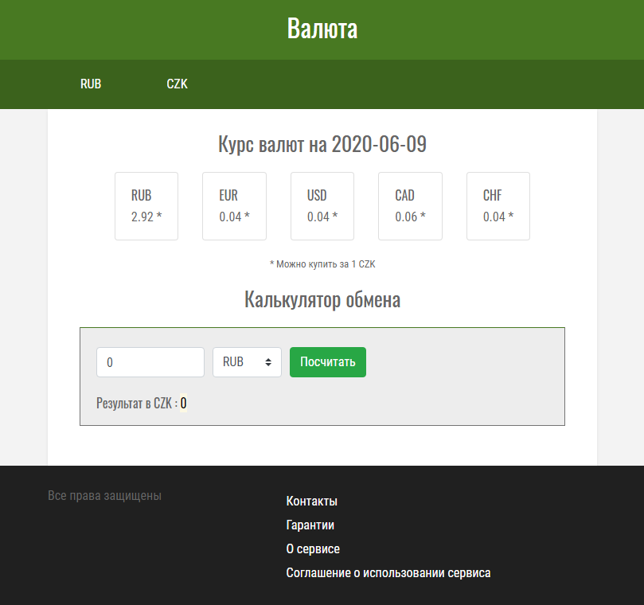

# Страница с получением и обработкой данных о курсах валют, простым калькулятором

## Задача
Получить наиболее актуальные данные о курсах валют. Настроечная константа с выбранными 3-5 валютами для конвертации и константа валюты, относительно которой происходит конвертация (базовая валюта). Отображение всего этого. Калькулятор. Две страницы с рублем и долларом в качестве базовых валют.

