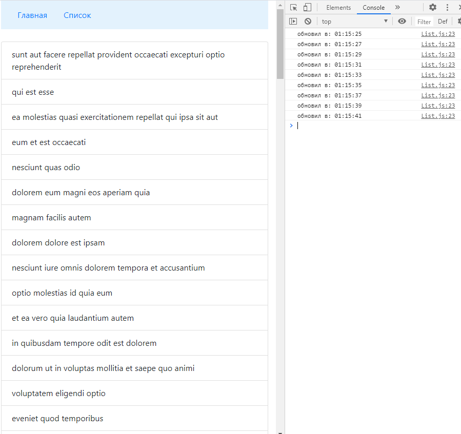

# Получение данных для списка и постоянное обновление данных 

## Задача
- Страница со статическими данными и страница со списком
- Список должен быть получен через fetch с тестовыми данными
- Список должен быть получен после загрузки страницы и перезапрашиваться через заданный интервал после получения данных или ошибки, т.е. если произойдет задержка (в том числе из-за медленного интернета), то интервал будет выдержан и запрос будет только после удачного получения данных
- И основное - в консоле не должно быть никаких ошибок ни при медленном интернете, ни при переходах между страницами во время запросов данных

## Решение
- Изначальный запуск функции с запросом данных после монтирования страницы - в componentDidMount()
- Функция с рекурсией

