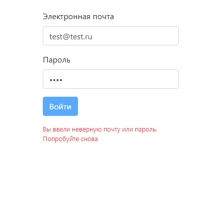

# Страница ввода эл.почты и пароля

## Задача
При вводе логина и пароля кнопка отправки блокируется на 3 сек. и выдается сообщение о неправильном пароле.

## Что сделано
- Кнопка отправки доступна только после заполнения обоих полей
- Предупреждение появляется после 3-х секунд и пропадает после того как пользователь снова начнет изменять данные в полях

